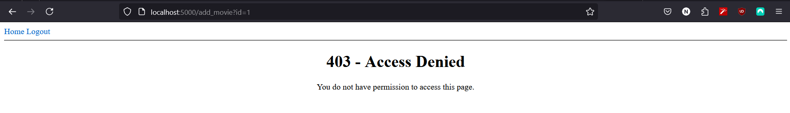
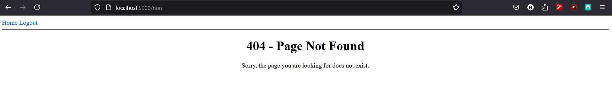

# Movies App

A simple Flask web application that allows users to register, log in, and manage their own list of movies. Each user can add, edit, and delete movies, and the movies are associated with the user who created them.

## Features

- User registration and authentication
- Add new movies
- Edit existing movies
- Delete movies
- Custom error handling for 403, 404, and 500 errors
- Per-user movie lists (users can only see and manage their own movies)

## Prerequisites

- Python 3.7 or higher
- SQLite (comes pre-installed with Python)
- **Optional:** Conda (if you prefer using Conda for environment management, like I do)

## Getting Started

1. **Clone the Repository**

   ```sh
   git clone https://github.com/muniekstache/Movie-Flask-App.git
   cd flask_databse_as1
   ```


2. **Create a Virtual Environment**

   It's recommended to use a virtual environment to manage dependencies. You can choose between Python's built-in `venv` or Conda.

   **Using `venv`:**

   ```sh
   python -m venv venv
   ```

   **Using Conda:**

   ```sh
   conda create --name movies_env python=3.7
   ```

3. **Activate the Virtual Environment**

   Activate the environment you created.

   **Using `venv`:**

   - **On Windows:**

     ```sh
     venv\Scripts\activate
     ```

   - **On macOS/Linux:**

     ```sh
     source venv/bin/activate
     ```

   **Using Conda:**

   ```sh
   conda activate movies_env
   ```

4. **Install Dependencies**

   ```sh
   pip install -r requirements.txt
   ```

5. **Set Up the Database**

   Initialize the database and apply migrations.

   ```sh
   flask db init
   flask db migrate -m "Initial migration"
   flask db upgrade
   ```

6. **Set Environment Variables**

   Set the `FLASK_APP` environment variable to point to the application.

   - **On Windows Command Prompt:**

     ```sh
     set FLASK_APP=movies.py
     ```

   - **On macOS/Linux:**

     ```sh
     export FLASK_APP=movies.py
     ```

7. **Run the Application**

   ```sh
   flask run
   ```

   Alternatively, you can run the application directly using:

   ```sh
   python movies.py
   ```

8. **Access the Application**

   Open your web browser and navigate to:

   `http://localhost:5000/`

## Usage

### Register a New User

1. Click on the "Register" link in the navigation bar.
2. Fill out the registration form with a username, email, and password.
3. Submit the form to create a new account.

### Log In

1. Click on the "Login" link in the navigation bar.
2. Enter your username and password.
3. Submit the form to log in.

### Add a New Movie

1. After logging in, click on the "+" button at the bottom of the movies list or navigate to `http://localhost:5000/add_movie`.
2. Fill out the form with the movie name, release year, and number of Oscars won.
3. Submit the form to add the movie to your list.

### Edit a Movie

1. In your movies list, click on the "Edit" link next to the movie you want to edit.
2. Update the movie information in the form.
3. Submit the form to save changes.

### Delete a Movie

1. In your movies list, click on the "Delete" button next to the movie you want to delete.
2. Confirm the deletion if prompted. (future implementation)

## Custom Error Handling

The application includes custom error pages for:

- **403 Forbidden:** Displayed when a user tries to access a resource they do not have permission to access.

  

- **404 Not Found:** Displayed when a user tries to access a non-existent page.

  

- **500 Internal Server Error:** Displayed when an unexpected error occurs on the server.

  

## Proof API Functions

After Running test_api.py:

- Results of script in CLI:

  

- Proof of new user and movie creation reflected in front-end:

  

## Project Structure

```
movies_app/
├── app/
│   ├── __init__.py
│   ├── forms.py
│   ├── models.py
│   ├── routes.py
│   ├── templates/
│   │   ├── base.html
│   │   ├── index.html
│   │   ├── login.html
│   │   ├── register.html
│   │   ├── add_movie.html
│   │   └── errors/
│   │       ├── 403.html
│   │       ├── 404.html
│   │       └── 500.html
│   └── static/
│       └── css/
│           └── styles.css
├── documentation/
│   ├── error_403.png
│   ├── error_404.png
│   └── error_500.png
├── migrations/
│   └── ... (migration files)
├── movies.py
├── config.py
├── requirements.txt
└── README.rst
```

## Dependencies

The application relies on the following Python packages:

- **Flask:** Web framework
- **Flask-Login:** User session management
- **Flask-Migrate:** Database migrations using Alembic
- **Flask-SQLAlchemy:** SQLAlchemy integration with Flask
- **Flask-WTF:** Form handling
- **WTForms:** Form rendering and validation
- **Email-Validator:** Email validation for forms
- **SQLAlchemy:** SQL toolkit and Object-Relational Mapping (ORM)

These are specified in the `requirements.txt` file.
